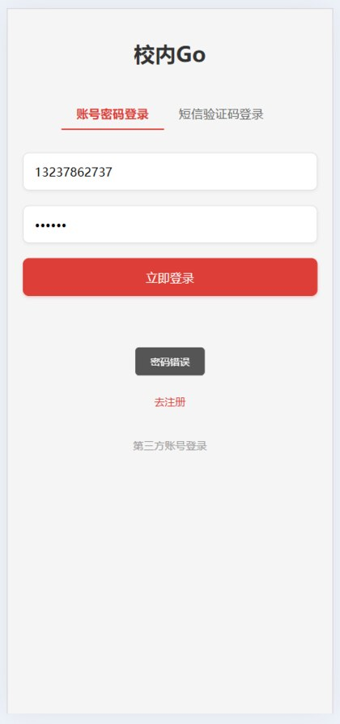
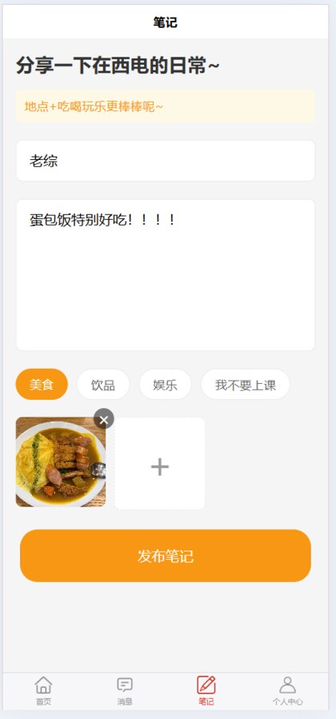
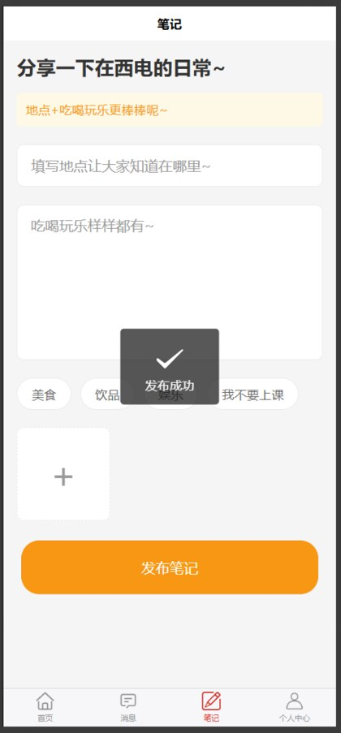
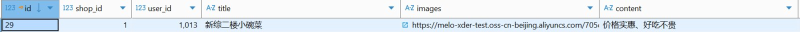
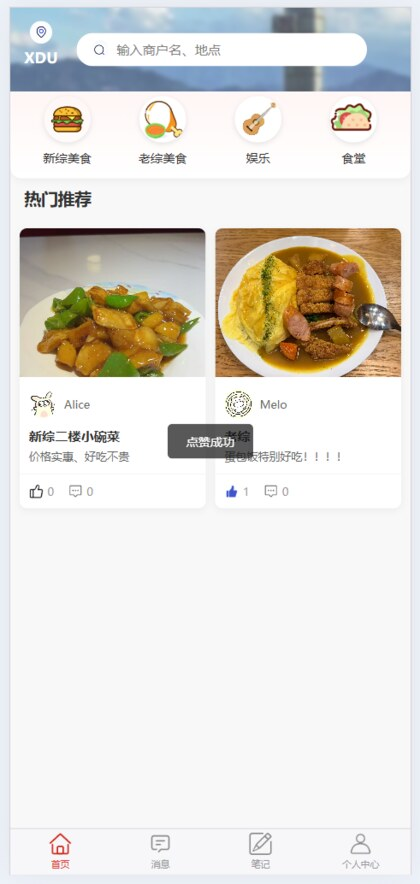
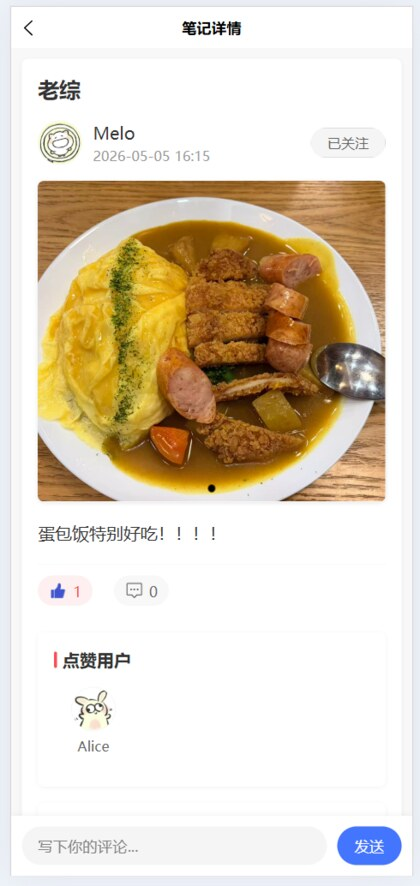
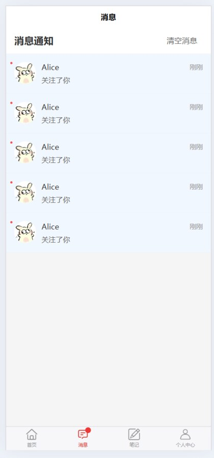
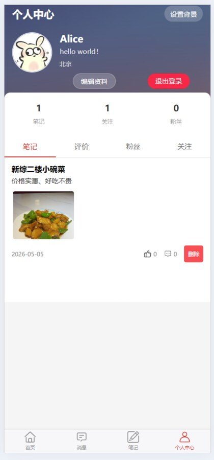

# CampusGo · 校园美食评价平台

CampusGo 是一个面向校园生活场景的前后端分离点评应用。用户可浏览校内及周边店铺、发布探店笔记、参与评论互动、关注其他用户，并接收点赞和关注通知。

项目在经典点评业务的基础上扩展了账号密码注册登录、多级评论、实时通知与优惠券秒杀等能力，适合作为 Spring Boot、Redis、RabbitMQ 与 uni-app 的综合实践项目。

## 功能概览

- **账户与资料**：验证码登录、账号密码注册/登录、登录状态校验、个人资料和头像编辑。
- **店铺浏览**：店铺分类、店铺详情、按分类分页查询、关键词搜索与店铺评价。
- **内容社区**：发布图文探店笔记、热门笔记、点赞、滚动分页、笔记删除与多级评论。
- **社交互动**：关注/取关、共同关注、粉丝与关注列表、个人笔记和评价记录。
- **实时消息**：点赞、评论和关注等事件通过 WebSocket 推送至在线用户。
- **优惠券秒杀**：Redis 预扣库存、分布式锁控制同一用户重复下单，并由 RabbitMQ 异步创建订单。
- **图片上传**：使用阿里云 OSS 保存用户头像与笔记图片。

## 技术栈

| 层级 | 技术 |
| --- | --- |
| 后端 | Java 8、Spring Boot 2.3.12、Spring MVC、MyBatis-Plus |
| 数据与缓存 | MySQL 5.7+、Redis |
| 消息与实时通信 | RabbitMQ、WebSocket |
| 前端 | uni-app、Vue 3、HBuilderX |
| 工具与组件 | Maven、Lombok、Hutool、Knife4j、阿里云 OSS SDK |

## 项目结构

```text
campusgo/
├── campusgo_front/                  # uni-app 前端
│   ├── pages/                       # 首页、店铺、笔记、消息、个人中心等页面
│   ├── api/                         # 请求封装
│   ├── config/api.config.js         # 后端与 WebSocket 地址配置
│   └── static/                      # 图标和页面资源
├── campusgo_springboot/             # Spring Boot 后端
│   ├── src/main/java/com/hmdp/
│   │   ├── controller/              # REST 接口
│   │   ├── service/                 # 业务服务
│   │   ├── config/                  # Redis、RabbitMQ、WebSocket 等配置
│   │   └── handler/                 # WebSocket 通知处理
│   └── src/main/resources/
│       ├── application.yaml         # 应用配置
│       └── db/                      # 数据库脚本
└── README.md
```

## 快速开始

### 1. 准备环境

- JDK 8
- Maven 3.6+
- MySQL 5.7+
- Redis 6+
- RabbitMQ 3.8+
- HBuilderX（用于运行 uni-app 前端）

### 2. 初始化数据库

创建数据库 `hmdp`，并导入后端提供的初始化脚本：

```bash
mysql -u root -p -e "CREATE DATABASE hmdp DEFAULT CHARACTER SET utf8mb4;"
mysql -u root -p hmdp < campusgo_springboot/src/main/resources/db/hmdp.sql
```

`hmdp.sql` 包含基础表结构和示例数据；`hmdp_new.sql` 为补充/调整表结构的参考脚本，请按实际数据库状态选择性执行，避免重复建表。

### 3. 配置后端服务

编辑 [`campusgo_springboot/src/main/resources/application.yaml`](campusgo_springboot/src/main/resources/application.yaml)，按本地环境更新以下配置：

- MySQL：数据库地址、用户名和密码；
- Redis：地址、端口和数据库编号；
- RabbitMQ：地址、账号和密码；
- 阿里云 OSS：通过环境变量 `ALIBABA_CLOUD_ACCESS_KEY_ID`、`ALIBABA_CLOUD_ACCESS_KEY_SECRET` 配置访问凭证。

建议通过环境变量传入数据库与 RabbitMQ 凭证，例如 `DB_PASSWORD`、`RABBITMQ_PASSWORD`，不要把真实密码提交到仓库。

启动 Redis 和 RabbitMQ 后，进入后端目录运行：

```bash
cd campusgo_springboot
mvn spring-boot:run
```

服务默认监听 `http://localhost:8081`，WebSocket 通知地址为 `ws://localhost:8081/ws/notification`。

### 4. 运行前端

1. 使用 HBuilderX 导入 `campusgo_front` 目录；
2. 检查 [`campusgo_front/config/api.config.js`](campusgo_front/config/api.config.js) 中的 `baseURL`，本地联调时设为 `http://localhost:8081`；
3. 选择“运行到浏览器”或“运行到小程序模拟器”。

如果后端部署在远程服务器，请同时更新 `baseURL`，WebSocket 地址会由前端配置自动转换为 `ws://` 或 `wss://`。

## 核心实现

### Redis 缓存与并发控制

- 店铺与店铺分类数据采用 Redis 缓存，缓存空值以降低缓存穿透风险；
- 使用互斥锁逻辑应对缓存重建时的并发访问；
- 用户登录信息存入 Redis Hash，并由拦截器校验与续期；
- 关注关系使用 Redis Set，支持查询共同关注；
- 笔记点赞用户以 Redis ZSet 保存，按最近点赞时间排序；
- 秒杀库存先在 Redis 中扣减，并通过用户维度锁避免重复下单。

### 异步订单与消息通知

- 秒杀请求通过 RabbitMQ 解耦，消费者异步完成库存校验和订单持久化；
- 服务端注册 `/ws/notification` WebSocket 端点，在线用户可接收互动通知；
- WebSocket 握手阶段从 Redis 中校验登录态，避免匿名连接。

## 工程过程与测试

项目在 2026 年 3—5 月完成需求梳理、前后端开发、联调和回归测试。仓库保留了可复核的功能验证截图；开发分工、测试范围、缺陷闭环和文档与代码的校准记录见 [工程过程说明](docs/ENGINEERING_NOTES.md)。

## 功能验证截图

以下截图来自本地联调过程，覆盖登录校验、笔记发布、数据落库、互动和通知等关键链路。

| 登录校验 | 发布笔记 |
| --- | --- |
|  |  |

| 发布成功 | 数据库记录 |
| --- | --- |
|  |  |

| 首页点赞 | 笔记详情 |
| --- | --- |
|  |  |

| 关注通知 | 个人中心 |
| --- | --- |
|  |  |

## 注意事项

- 本项目使用本地基础设施进行开发，生产部署前应将所有账号、密码与 OSS 凭证移至环境变量或密钥管理服务，禁止提交真实凭证。
- 后端跨域配置和 WebSocket 允许来源应在生产环境限制为实际前端域名。
- 当前演示数据中的店铺信息主要用于本地功能验证，部署前应替换为真实且合规的数据源。

## 参考项目

- [XDer 点评前端](https://gitee.com/yuwozai618/xder-reviews-uniapp-front-end)
- [XDer 点评后端](https://gitee.com/yuwozai618/hmdp001)

本项目在参考上述项目的基础上进行了校园场景适配与功能扩展。

## License

本仓库仅用于学习与交流。若用于二次开发或部署，请自行确认第三方依赖、素材和数据的使用授权。
