# XDer点评开源文档

>作者：[拒过李一桐](https://gitee.com/yuwozai618)

>[Gitee仓库主页](https://gitee.com/yuwozai618/projects)

## ☀️必读

+ **为什么要做本项目：想必大家已经受够了面试官的经典问题：项目上线了没有？？项目的QPS是多少？针对这个问题我们每次都是老老实实回答没有上线或许没办法让面试官眼前一亮，那么该如何破局呢？上线！**

+ **本项目后端基于Java后端开发选手必做项目：白马点评 对进行白马点评魔改，只要你学过点评和外卖就可以轻松上手**

+ **前端基于uniapp可以实现实现各种小程序以及安卓/IOS程序，你说你没学过前端？没关系，基本的功能已经全部帮你实现，只需要下载运行即可。**

+ **当你下载好前后端跑起来之后，那么你就可以开始考虑魔改了：你是xxx学校，那么名字就可以叫做xxx点评 xxx校园点评 ，为方便看不懂前端的小伙伴修改前端页面，项目logo已经全部删除，你只需要打开前端页面，简单修改为你学校的名字就可以。再也不需要担心面试官想看你的项目却因为前端界面展示问题（项目在实验室电脑上......），面试过程中如果可以大大方方展示自己的项目是非常加分的！**

  

+ [项目前端地址](https://gitee.com/yuwozai618/xder-reviews-uniapp-front-end)

+ [项目后端地址](https://gitee.com/yuwozai618/hmdp001)

## ☀️项目介绍

**这是一款针对xxx校内商铺的点评项目，结合校内师生的痛点：校内美食众多，经常会犹豫吃什么的问题，那么我们想要打造一个只关注于讨论校园内美食（吃喝玩乐）的社区，希望帮助xxx师生在校内众多店铺吃不过来（吃腻）时，可以打开app查看大家分享的美食，彻底解决选择困难症。**

> 
>
> 

## ☀️功能和特性

1）用户登录功能：包括短信验证码登录和用户名密码登录，用户能够通过手机号实现账户注册

实现逻辑：当用户选择短信验证码登录时，必须先注册，填写密码；后续可以选择短信密码登录或短信验证码登录

	
	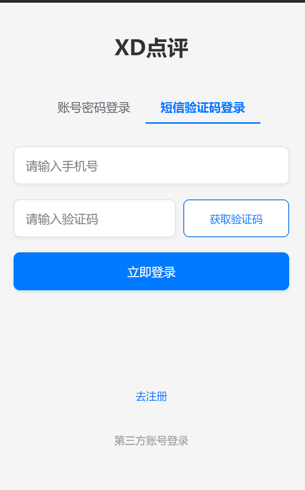
	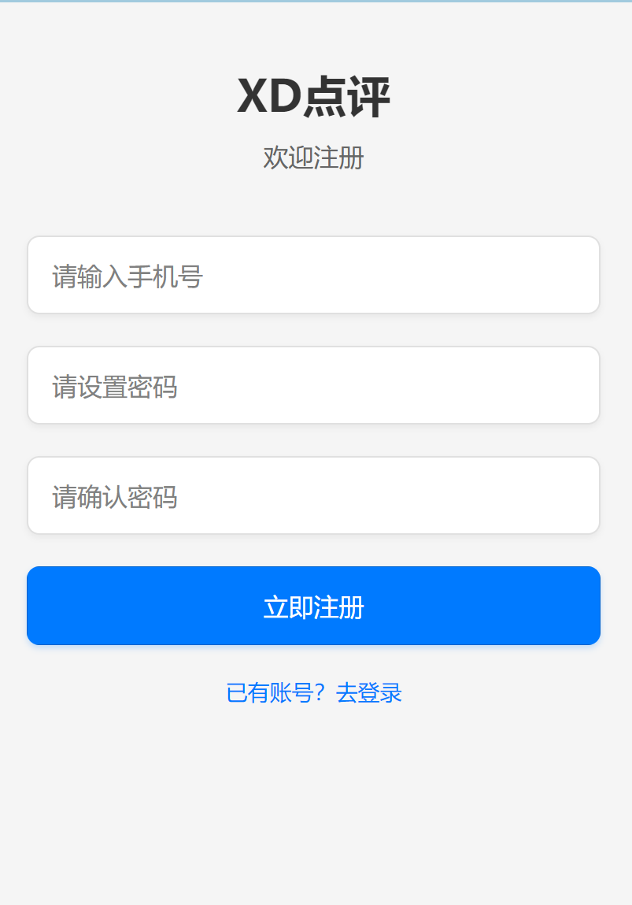

2）个人信息：查看昵称、头像、个性签名、所在城市，并通过编辑个人资料实现对以上信息的修改

    
    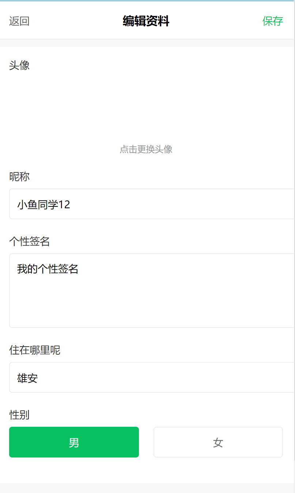

3）笔记专栏：展示最近热门笔记，对笔记点赞、评论（包括多级评论)，展示点赞用户头像并排序

    
    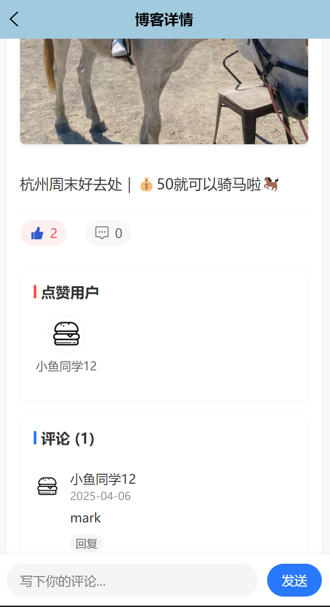
    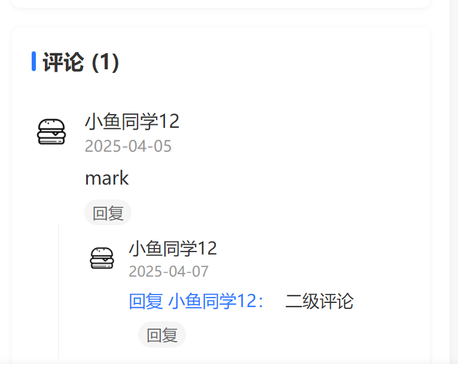

4）发布笔记：新建笔记，查看自身发布的笔记内容，统计自身发布笔记数量

    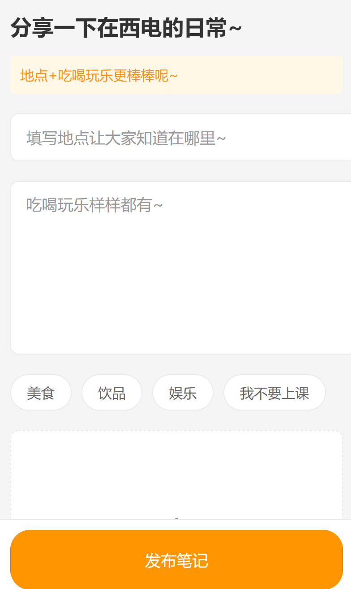
    

5）统计评价：在个人中心中，统计用户发出的所有评价，并展示所一级评价的笔记

功能类似于在牛客发布评论，mark一下，在个人中心展示记录

6）关注用户：关注其他用户，取消关注，统计自身关注的用户数并统一展示

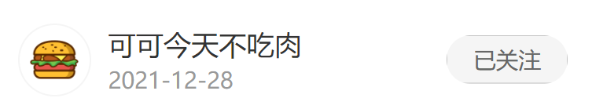

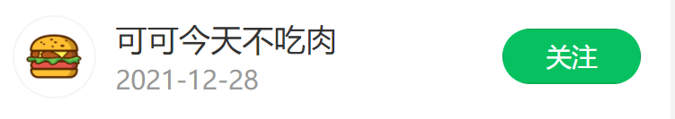

## ☀️项目亮点

**（面试怎么讲，只讲面试官喜欢听的）**

1）本项目采用前后端分离的模式，前端基于uniapp构建，可以打包成为任意小程序 以后面试哪个公司就打包成谁家的小程序（bushi

后端如果你学习过白马点评，那么后端的内容你就已经掌握了80%，没学过也不要紧，先跑起来，逐步拆解分析，借助大模型上手飞快

接下来讲解基于白马点评的扩展部分

2）实现了注册以及账号密码登录功能（密码可以采取各种加密方式，不再赘述）

3）后端已开启 CORS 跨域支持，采用权限拦截器进行权限校验，并检查登录情况（此处为跨域的一种解决方式，还可以通过前端来解决

4）首页根据点赞数量采用**瀑布流双列**展示笔记内容，后端采用order by根据点赞数量进行排序（此处可以考虑对**order by语句进行sql优化**）

5）实现了**多级评论**功能，只需要在数据表中给一条评论添加一个parent_id，首级评论的parent_id默认为0（圈起来，面试被问到过

6）实现了编辑个人资料功能，这里mark重点，涉及到**ThreadLocal**，因为白马点评的查询个人信息接口是直接返回登录时存储在ThreadLocal中的信息，这就意味这一次登录这里面的信息是不会变的，需要下一次登录才能看到，所以这里修改之后个人基础信息不会立刻改变，需要修改实现逻辑，每次都需要查询数据库获得个人信息

7）实现查询评论功能（这里我们认为**只有首级评论算做评论，其余算作回复**），这里是想做成一个mark功能，类似于newcoder评论区的mark 某某面经，可以mark别人发的校园里的吃喝玩乐（充分结合需求，还有市场分析~

8）白马点评中实现的滚动分页查询算是项目中实现起来的一个难点，但是如果你没有一个好的前端页面展示，可能无法理解为什么需要滚动分页，传统的分页方式为什么不可以，通过前端页面的下拉刷新，同时数据库插入数据，会看到同样的内容前端展示了两遍，立马就能理解为什么要滚动分页。面试的时候可以和面试官吹自己在前端尝试…… 结果发现同样的数据展示了两遍…… 于是考虑滚动分页查询，有理有据，有因有果，加上自己的理解与思考，而不是单纯的照搬学习，面试好感upup！！

9）本项目前端全部基于**cursor**实现，借助cursor实现基本CRUD功能可以极大提高开发效率，同时在多人协同开发过程中解决版本冲突问题非常方便（面试高频：Git的使用），如果你没有使用过cursor，可以找我要一份文档：关于我自己在实际开发本项目过程中是如何使用cursor的，真实接地气，站在一个即将走出校园参与校招的学生的角度，避免与网上内容雷同，亲测有效，**鹅和度子面试官**听了都说好！

待实现的亮点：

10）基于**协同过滤算法**实现猜你喜欢功能（大致思路是结合用户对店铺的评分，然后根据皮尔逊相关系数找到行为最相似的两个用户，java dog还有算法功能的实现！？？这不把面试官唬得~~~）

11）在消息界面可以接受到点赞以及关注的通知，可以考虑使用消息队列进行解耦，异步通知（此处重点关注**为什么要选择xxx消息队列**，为什么不选择其他消息队列的问题，面试高频问题）

注：由于篇幅问题，此处我只展示部分与白马点评不同的内容，如果看完还是觉得无法和面试官侃侃而谈，可以给前后端项目都点一个小小的star，然后带着截图**添加我的个人微信或者QQ，我会将项目的详细文档**：**从项目介绍一直到项目实现的每个细节，都发送给你，保证你彻底了解点评项目**。从来没有什么烂大街项目，只是因为别人将太多精彩的地方全部都封装好了，导致我们看不清全貌，所以我来带着你彻底拆解点评项目，让你的“点评”不再是“大众点评”。全部内容免费！免费！免费！开源！开源！开源！只求大家点个免费的小心心，开源不易，你的点赞会让我更加努力的更新尚未实现的功能，编写更好更详细更能够体现你在做项目过程有自己独立思考的文档，以供大家在面试过程中如庖丁解牛般游刃有余，做到真正的如数家珍，收放自如。

## ☀️运行方式

2 分钟快速上手使用项目

### **后端：**

1）后端与白马点评启动方式类似，需要启动Redis

2） 在application.yaml文件下，配置自己数据库以及Redis的连接信息即可

**注意注意：切记不要修改后端项目的端口号，否则前端无法向后端发送请求！保持8081即可**

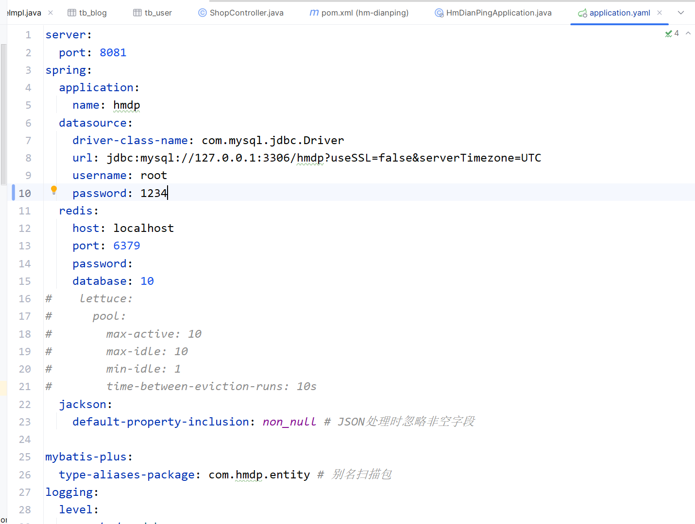

3）找到启动类，启动即可

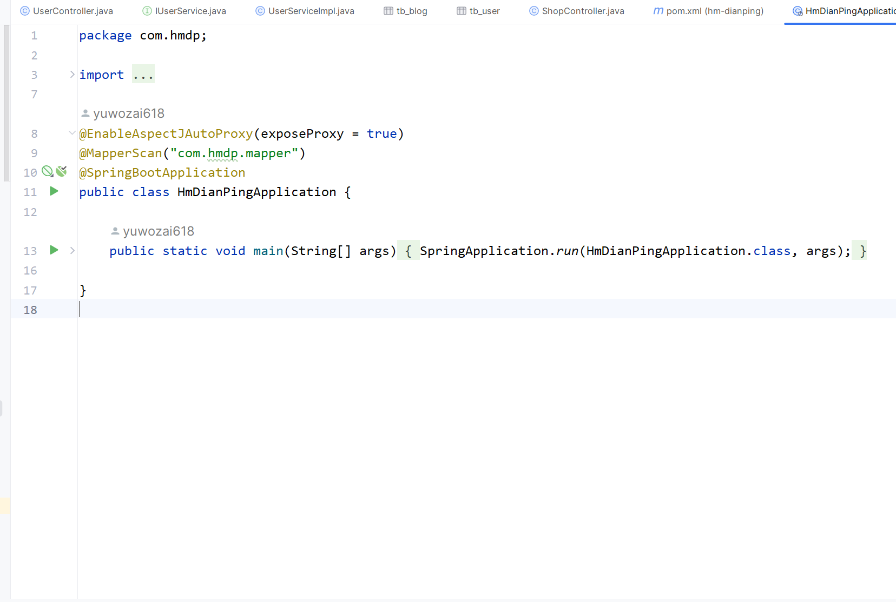

4）启动之后如果在控制台看到以下信息，说明后端服务启动成功！

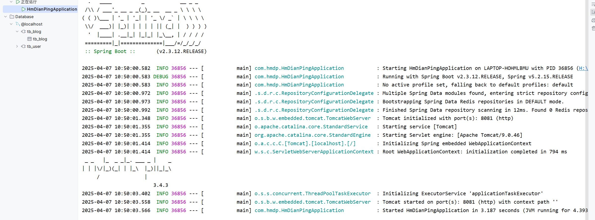

### **前端：**

1）软件：HBuilderX（推荐上uni-app官网简单了解，并且有下载地址，直接下载就好）

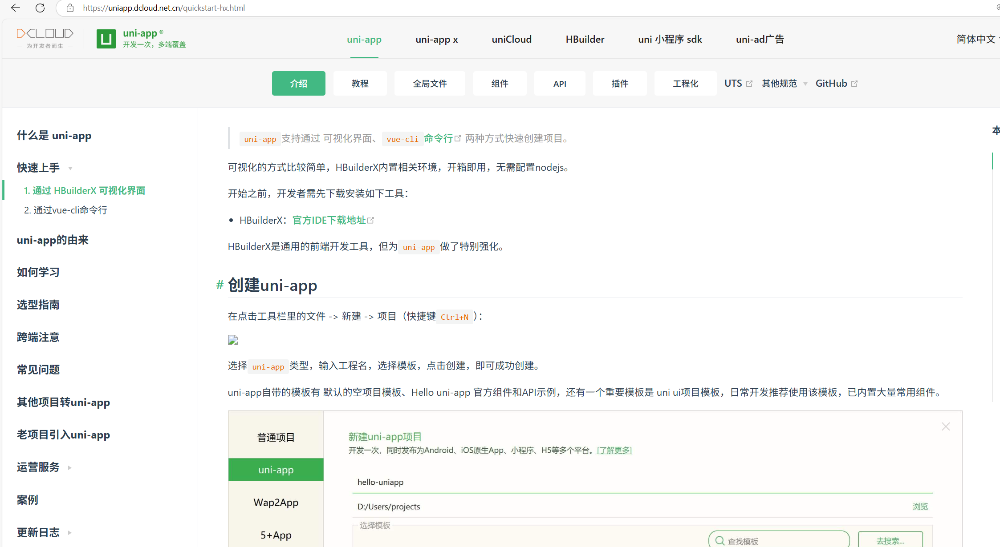

2）下载好之后，直接点击左上角文件，将前端项目导入即可

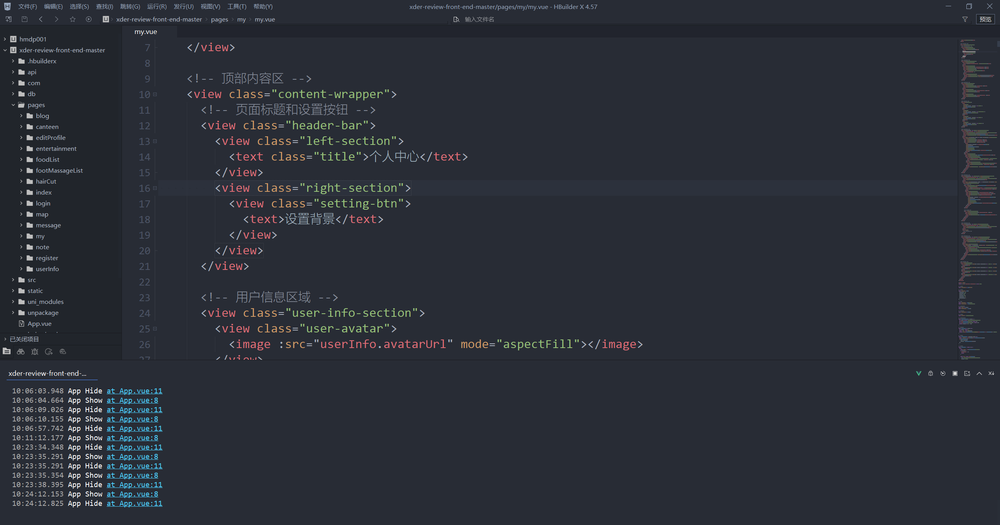

3）导入之后，点击运行---运行到浏览器---选择合适的浏览器打开即可（推荐使用Chrome或者Edge）

### 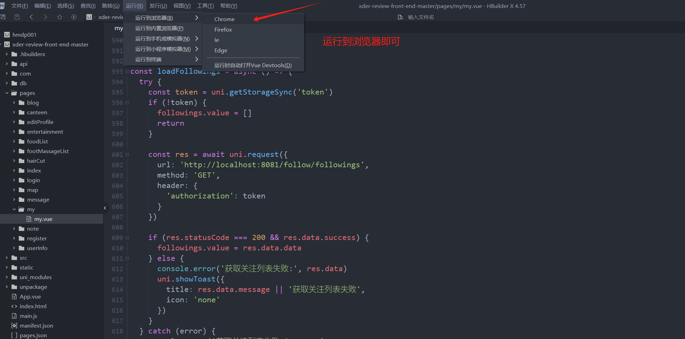

4）运行之后，会自动弹出浏览器页面，当你能看到类似如下页面，就代表前端项目已经成功启动！！

**注意：由于后端的跨域配置，这里需要确保的前端项目跑在5173端口号！！！！**

## ☀️技术选型

### 前端

基于uni-app（只需要上官网简单了解即可，支持一键部署）

`uni-app` 是一个使用 [Vue.js](https://vuejs.org/) 开发所有前端应用的框架，开发者编写一套代码，可发布到iOS、Android、Web（响应式）、以及各种小程序（微信/支付宝/百度/头条/飞书/QQ/快手/钉钉/淘宝）、快应用等多个平台。

### 后端

| **技术及版本**                     | **作用**                                                     | **版本**                          |
| ---------------------------------- | ------------------------------------------------------------ | --------------------------------- |
| SpringBoot                         | 应用开发框架                                                 | 2.3.12                            |
| JDK                                | Java 开发包                                                  | 1.8                               |
| MySQL                              | 提供后端数据库                                               | 5.1.47                            |
| MyBatisPlus                        | 提供连接数据库和快捷的增删改查                               | 3.4.3                             |
| SpringBoot-Configuration-processor | 配置处理器 定义的类和配置文件绑定一般没有提示，因此可以添加配置处理器，产生相对应的提示. |                                   |
| SpringBoot-Starter-Web             | 后端集成Tomcat MVC                                           | 用于和前端连接                    |
| Lombok                             | 实体类方法的快速生成 简化代码                                |                                   |
| hutool                             | hutool工具包(简化开发工具类)                                 | [文档](https://hutool.cn/docs/#/) |

## ☀️部署项目问题

⭐

+ 详细文档还在加急制作中~~~~请耐心等待~

+ **QQ：1345401167**

+ **WX：Yuwozai_618**

+ 遇到任何问题，欢迎大家**带着前后端小心心的截图**添加微信或者QQ来与我沟通，看到以后会及时解决大家的问题

+ 更多详细文档内容还在加急制作中，**您的支持**会让我更加有动力做下去！！

